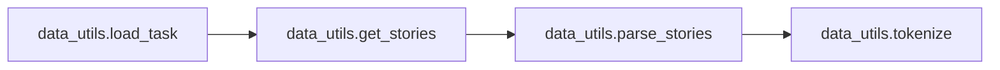
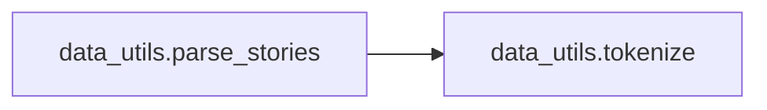
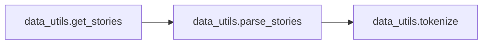

# Key Objects

[_Documentation generated by Documatic_](https://www.documatic.com)

<!---Documatic-section-memn2n_kv.zero_nil_slot-start--->
## memn2n_kv.zero_nil_slot

<!---Documatic-section-zero_nil_slot-start--->
<!---Documatic-block-memn2n_kv.zero_nil_slot-start--->
<details>
	<summary><code>memn2n_kv.zero_nil_slot</code> code snippet</summary>

```python
def zero_nil_slot(t, name=None):
    with tf.name_scope(name, 'zero_nil_slot', [t]) as name:
        t = tf.convert_to_tensor(t, name='t')
        s = tf.shape(t)[1]
        z = tf.zeros(tf.pack([1, s]))
        return tf.concat([z, tf.slice(t, [1, 0], [-1, -1])], 0, name=name)
```
</details>
<!---Documatic-block-memn2n_kv.zero_nil_slot-end--->
<!---Documatic-section-zero_nil_slot-end--->

# #
<!---Documatic-section-memn2n_kv.zero_nil_slot-end--->

<!---Documatic-section-memn2n_kv.add_gradient_noise-start--->
## memn2n_kv.add_gradient_noise

<!---Documatic-section-add_gradient_noise-start--->
<!---Documatic-block-memn2n_kv.add_gradient_noise-start--->
<details>
	<summary><code>memn2n_kv.add_gradient_noise</code> code snippet</summary>

```python
def add_gradient_noise(t, stddev=0.001, name=None):
    with tf.name_scope(name, 'add_gradient_noise', [t, stddev]) as name:
        t = tf.convert_to_tensor(t, name='t')
        gn = tf.random_normal(tf.shape(t), stddev=stddev)
        return tf.add(t, gn, name=name)
```
</details>
<!---Documatic-block-memn2n_kv.add_gradient_noise-end--->
<!---Documatic-section-add_gradient_noise-end--->

# #
<!---Documatic-section-memn2n_kv.add_gradient_noise-end--->

<!---Documatic-section-data_utils.tokenize-start--->
## data_utils.tokenize

<!---Documatic-section-tokenize-start--->
<!---Documatic-block-data_utils.tokenize-start--->
<details>
	<summary><code>data_utils.tokenize</code> code snippet</summary>

```python
def tokenize(sent):
    return [x.strip() for x in re.split('(\\W+)?', sent) if x.strip()]
```
</details>
<!---Documatic-block-data_utils.tokenize-end--->
<!---Documatic-section-tokenize-end--->

# #
<!---Documatic-section-data_utils.tokenize-end--->

<!---Documatic-section-memn2n_kv.position_encoding-start--->
## memn2n_kv.position_encoding

<!---Documatic-section-position_encoding-start--->
<!---Documatic-block-memn2n_kv.position_encoding-start--->
<details>
	<summary><code>memn2n_kv.position_encoding</code> code snippet</summary>

```python
def position_encoding(sentence_size, embedding_size):
    encoding = np.ones((embedding_size, sentence_size), dtype=np.float32)
    ls = sentence_size + 1
    le = embedding_size + 1
    for i in range(1, le):
        for j in range(1, ls):
            encoding[i - 1, j - 1] = (i - (le - 1) / 2) * (j - (ls - 1) / 2)
    encoding = 1 + 4 * encoding / embedding_size / sentence_size
    return np.transpose(encoding)
```
</details>
<!---Documatic-block-memn2n_kv.position_encoding-end--->
<!---Documatic-section-position_encoding-end--->

# #
<!---Documatic-section-memn2n_kv.position_encoding-end--->

<!---Documatic-section-data_utils.vectorize_data-start--->
## data_utils.vectorize_data

<!---Documatic-section-vectorize_data-start--->
<!---Documatic-block-data_utils.vectorize_data-start--->
<details>
	<summary><code>data_utils.vectorize_data</code> code snippet</summary>

```python
def vectorize_data(data, word_idx, sentence_size, memory_size):
    S = []
    Q = []
    A = []
    for (story, query, answer) in data:
        ss = []
        for (i, sentence) in enumerate(story, 1):
            ls = max(0, sentence_size - len(sentence))
            ss.append([word_idx[w] for w in sentence] + [0] * ls)
        ss = ss[::-1][:memory_size]
        lm = max(0, memory_size - len(ss))
        for _ in range(lm):
            ss.append([0] * sentence_size)
        lq = max(0, sentence_size - len(query))
        q = [word_idx[w] for w in query] + [0] * lq
        y = np.zeros(len(word_idx) + 1)
        for a in answer:
            y[word_idx[a]] = 1
        S.append(ss)
        Q.append(q)
        A.append(y)
    return (np.array(S), np.array(Q), np.array(A))
```
</details>
<!---Documatic-block-data_utils.vectorize_data-end--->
<!---Documatic-section-vectorize_data-end--->

# #
<!---Documatic-section-data_utils.vectorize_data-end--->

<!---Documatic-section-data_utils.load_task-start--->
## data_utils.load_task

<!---Documatic-section-load_task-start--->


### Object Calls

* data_utils.get_stories

<!---Documatic-block-data_utils.load_task-start--->
<details>
	<summary><code>data_utils.load_task</code> code snippet</summary>

```python
def load_task(data_dir, task_id, only_supporting=False):
    assert task_id > 0 and task_id < 21
    files = os.listdir(data_dir)
    files = [os.path.join(data_dir, f) for f in files]
    s = 'qa{}_'.format(task_id)
    train_file = [f for f in files if s in f and 'train' in f][0]
    test_file = [f for f in files if s in f and 'test' in f][0]
    train_data = get_stories(train_file, only_supporting)
    test_data = get_stories(test_file, only_supporting)
    return (train_data, test_data)
```
</details>
<!---Documatic-block-data_utils.load_task-end--->
<!---Documatic-section-load_task-end--->

# #
<!---Documatic-section-data_utils.load_task-end--->

<!---Documatic-section-data_utils.parse_stories-start--->
## data_utils.parse_stories

<!---Documatic-section-parse_stories-start--->


### Object Calls

* data_utils.tokenize

<!---Documatic-block-data_utils.parse_stories-start--->
<details>
	<summary><code>data_utils.parse_stories</code> code snippet</summary>

```python
def parse_stories(lines, only_supporting=False):
    data = []
    story = []
    for line in lines:
        line = str.lower(line)
        (nid, line) = line.split(' ', 1)
        nid = int(nid)
        if nid == 1:
            story = []
        if '\t' in line:
            (q, a, supporting) = line.split('\t')
            q = tokenize(q)
            a = [a]
            substory = None
            if q[-1] == '?':
                q = q[:-1]
            if only_supporting:
                supporting = map(int, supporting.split())
                substory = [story[i - 1] for i in supporting]
            else:
                substory = [x for x in story if x]
            data.append((substory, q, a))
            story.append('')
        else:
            sent = tokenize(line)
            if sent[-1] == '.':
                sent = sent[:-1]
            story.append(sent)
    return data
```
</details>
<!---Documatic-block-data_utils.parse_stories-end--->
<!---Documatic-section-parse_stories-end--->

# #
<!---Documatic-section-data_utils.parse_stories-end--->

<!---Documatic-section-data_utils.get_stories-start--->
## data_utils.get_stories

<!---Documatic-section-get_stories-start--->


### Object Calls

* data_utils.parse_stories

<!---Documatic-block-data_utils.get_stories-start--->
<details>
	<summary><code>data_utils.get_stories</code> code snippet</summary>

```python
def get_stories(f, only_supporting=False):
    with open(f) as f:
        return parse_stories(f.readlines(), only_supporting=only_supporting)
```
</details>
<!---Documatic-block-data_utils.get_stories-end--->
<!---Documatic-section-get_stories-end--->

# #
<!---Documatic-section-data_utils.get_stories-end--->

[_Documentation generated by Documatic_](https://www.documatic.com)